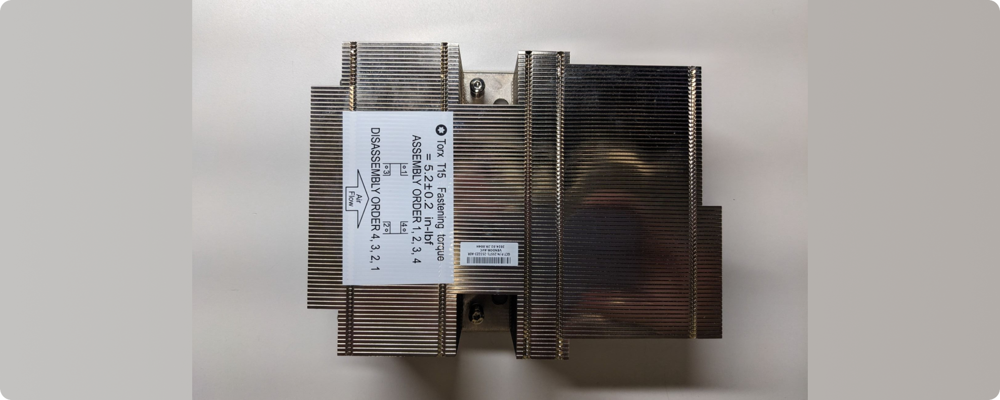
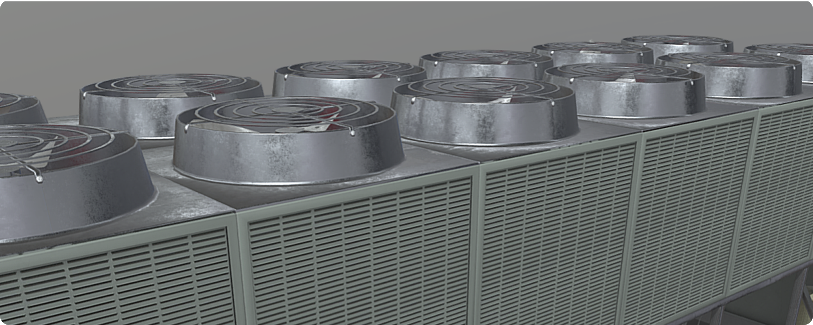
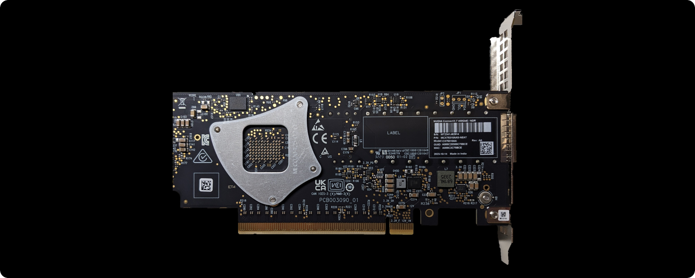
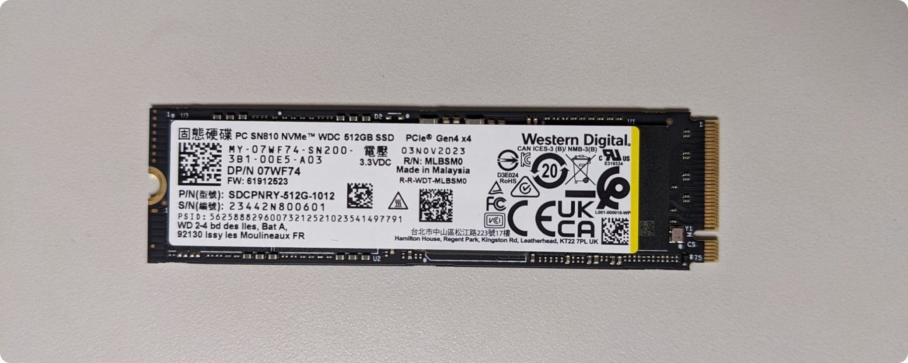
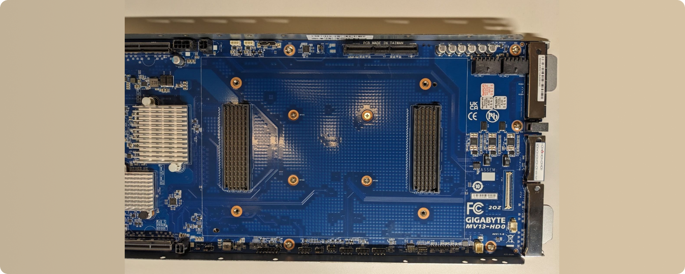
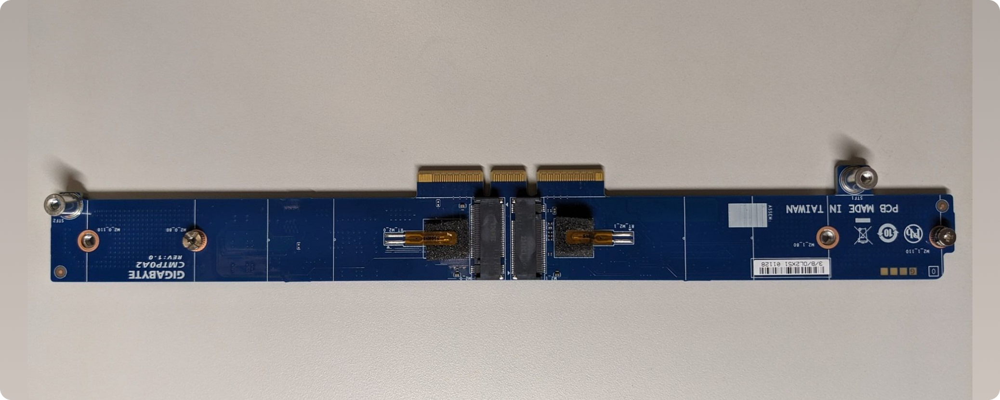
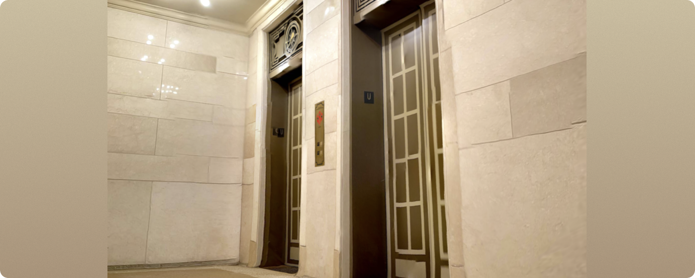
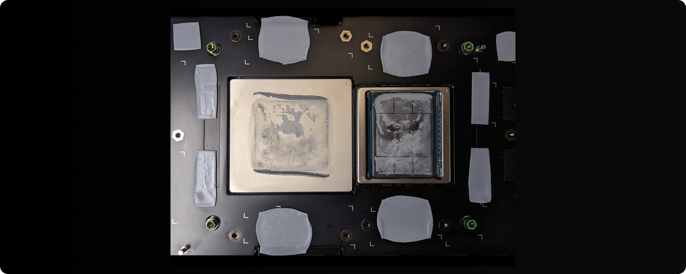

# LCCF XR - AR SuperCity

Leadership Class Computing Facility (LCCF) Extended Reality (XR) is a web-based augmented reality (AR) application that delivers the AR SuperCity educational experience, an interactive AR exhibit designed to help users learn how supercomputers work. The experience runs directly in a mobile web browser and overlays interactive 3D models of supercomputer components onto real world image targets.

The project is built using WebXR technologies and the 8th Wall framework, enabling users to explore computing concepts through immersive interaction and visual analogies.

This repository contains the source code and assets used to build and run the AR experience locally.


## Overview
AR SuperCity is an augmented reality learning experience developed to teach users about the structure and functionality of modern supercomputers through interactive 3D visualization and analogy-based instruction.

The experience was created as part of research at the Texas Advanced Computing Center (TACC) to explore how immersive technologies can support learning about complex computing systems.

Users interact with the system by:

1. Launching the AR web application
2. Scanning image targets placed in the physical environment
3. Viewing interactive 3D models of supercomputer components
4. Learning how each component works through explanations and analogies


## Get Started

### Requirements
Before building or running the project, install the following tools:

### 1. Node.js

Node.js is required to manage dependencies and run the development server.

Recommended version:

```bash
Node.js 18+
```

Verify installation:

```bash
node -v
npm -v
```

If Node is not installed, download it from:

https://nodejs.org/


## Installation
Clone the repository and install dependencies.

### Clone the repository

```bash
git clone https://github.com/andrewsolis/lccf-xr.git
cd lccf-xr
```

### Install dependencies

```bash
npm install
```

This installs all required libraries defined in package.json.

## Running the App Locally
To start the local development server:

```bash
npm run serve
```

This command starts a local server that hosts the application.

After running the command, the terminal should display a local URL such as:

```bash
http://localhost:8080
```

You can open this URL in your browser to view the application UI.

However, AR functionality will not work properly on desktop browsers, since camera access and AR tracking require a mobile device.


## Testing on Mobile Devices
Because AR requires camera access and HTTPS, the experience must be opened on a mobile device through a secure connection.

One way to test locally on a phone is using ngrok.

### 1. Install ngrok

If you do not already have ngrok installed, install it using Homebrew:

```bash
brew install ngrok
```

Alternatively, download it from:

```bash
https://ngrok.com/download
```
### 2. Create an ngrok Account

Create a free account at:

```bash
https://ngrok.com/
```

After signing up, copy your authtoken from:

```bash
https://dashboard.ngrok.com/get-started/your-authtoken
```

### 3. Add Your Authentication Token

Run the following command once to connect ngrok to your account:

```bash
ngrok config add-authtoken <YOUR_TOKEN>
```

Replace <YOUR_TOKEN> with the token from your ngrok dashboard.

### 4. Start the Local Server

In one terminal:

```bash
npm run serve
```

### 5. Start the HTTPS Tunnel

In a second terminal:

```bash
ngrok http 8080
```

Ngrok will generate an HTTPS forwarding address similar to:

```bash
https://example-name.ngrok-free.dev
```

### 6. Open the Experience on Your Phone

- Copy the HTTPS ngrok URL
- Open it on your mobile device browser
- Tap Get Started
- Allow camera access
- Point the camera at one of the image targets

### Image Targets

Image targets used for AR tracking are located in:

```bash
image-targets/
```

Each target contains several generated images.

The files most useful for testing are:

*_target.png

*_target.jpeg

These images should be displayed on another screen or printed and scanned by the phone camera.


## Building for Production

To generate a production-ready build:

```bash
npm run build
```

This compiles and bundles the application for deployment.

The build output will be placed in:

```bash
dist/
```

This directory can be hosted on any static web server.

## Project Team

| Name | Role | Contact |
|-----|-----|-----|
| Andrew Solis | Principal Investigator | [asolis@tacc.utexas.edu](mailto:asolis@tacc.utexas.edu) |
| MJ Johns | Senior UX Researcher | [mjjohnsdesigner.com](https://mjjohnsdesigner.com) |
| Jo Wozniak | RESA IV | [tacc.utexas.edu/about/staff-directory/jo-wozniak](https://tacc.utexas.edu/about/staff-directory/jo-wozniak) |
| Ayon Das | Software Engineer | [linkedin.com/in/ayon-saneel-das](https://linkedin.com/in/ayon-saneel-das) |
| Karen Heckel | Software Engineer | [linkedin.com/in/karen-heckel](https://linkedin.com/in/karen-heckel) |
| Sanika Goyal | Experience Design Lead | [sanikagoyal.com](https://sanikagoyal.com) |
| Gloria Jang | Junior Visual / Experience Designer | [linkedin.com/in/minjoo-jang-056223243](https://linkedin.com/in/minjoo-jang-056223243) |
| Imelda Ishiekwene | UX Designer | |
| Pascal R Garcia | Contributor | |
| Tyler Henry | Contributor | |
| Dawn Hunter | Contributor | |

## Project Structure

- `src/`
  - Main application source code.
  - `.expanse.json` defines the AR scene graph and component hierarchy.
  - `index.html` entry point for the web application.
  - `app.js` configures XR behavior (e.g., image target loading).
  - `scripts/` custom ECS components and interaction logic.
  - `assets/` 3D models, fonts, audio, and other runtime assets.
  - `.dependencies/` internal dependency mappings used by the XR engine.

- `image-targets/`
  - Contains all image target JSON files used for AR tracking.
  - These are **loaded manually** via `XR8.XrController.configure` in `app.js`.

- `images/`
  - Static images used for documentation and testing.

- `external/`
  - Contains external runtime dependencies:
    - `runtime/` 8th Wall runtime
    - `xr/` XR engine

- `config/`
  - Webpack and build configuration files.
  - Includes loaders and TypeScript definitions.

- `node_modules/`
  - Installed npm dependencies.

- Root files:
  - `package.json` project dependencies and scripts
  - `tsconfig.json` TypeScript configuration
  - `.gitignore` git ignore rules
  - `README.md` project documentation


## Target Images for Testing

### Heat Sink (Supercomputer Component)


### AC (City Analogy)


---

### InfiniBand (Supercomputer Component)


### Delivery System (City Analogy)


---

### M.2 Storage (Supercomputer Component)


### Library (City Analogy)


---

### Motherboard (Supercomputer Component)


### Roads & Power Grid (City Analogy)


---

### Riser Card (Supercomputer Component)


### Elevators (City Analogy)


---

### Grace Hopper Superchip (Supercomputer Component)


### Government Officials (City Analogy)

